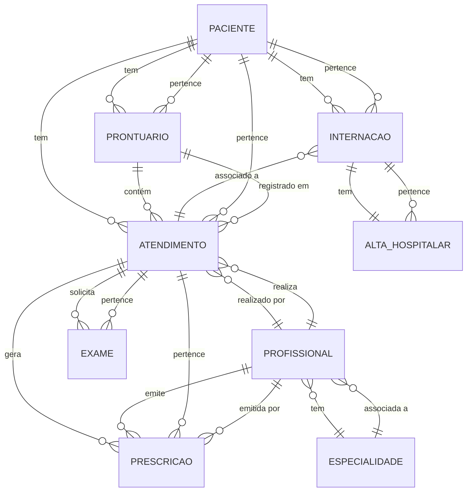

Aqui está o **README.md** completo em um único bloco de markdown para fácil cópia:

# Sistema de Gestão Hospitalar - A2-Hospital

## Visão Geral
O **A2-Hospital** é um sistema desenvolvido para gerenciar informações de pacientes, prontuários, atendimentos, prescrições, exames e internações em um hospital. Implementado com **ASP.NET Core** e **Entity Framework Core**.

O sistema suporta o cadastro de pacientes, consultas detalhadas de suas interações clínicas (atendimentos, prescrições, exames, internações) e relatórios estatísticos sobre pacientes, atendimentos, exames, prescrições e internações.

---

## Tecnologias

- **Backend**: ASP.NET Core
- **ORM**: Entity Framework Core
- **Banco de Dados**: SQL Server
- **Documentação**: OpenAPI 3.0.4 (Swagger)

---

## Estrutura do Projeto

- **A2_Hospital.Models**: Entidades do banco (ex.: Paciente, Prontuario, Atendimento).
- **A2_Hospital.Dtos**: DTOs para entrada/saída da API (ex.: PacienteFormularioDto, PacienteDetalhesDto).
- **A2_Hospital.Data**: Contexto do EF Core (HospitalContext) e configurações do banco.
- **A2_Hospital.Controllers**: Controladores da API (ex.: PacientesController, EstatisticasController, PacientesInformativoController).
- **A2_Hospital.Migrations**: Migrações do EF Core.

---

---

## Diagrama de Relacionamentos



---

## Como Executar a API

### Passos de Execução:

1. **Clonar o Repositório**

   Clone o repositório para sua máquina local.

   ```bash
   git clone https://github.com/seu-usuario/a2-hospital.git
   cd a2-hospital

2. **Configuração do Banco de Dados**

   Atualize o arquivo `appsettings.json` para configurar a conexão com o banco de dados.

   ```json
   {
     "ConnectionStrings": {
       "DefaultConnection": "Server=localhost;Database=HospitalDB;Trusted_Connection=True;"
     }
   }
   ```

3. **Aplicar Migrações**

   Aplique as migrações para criar as tabelas no banco de dados.

   ```bash
   Update-Database
   ```

4. **Executar a API**

   Execute o projeto utilizando o .NET CLI.

   ```bash
   dotnet run
   ```

   A API estará disponível em [http://localhost:5213](http://localhost:5213).

---

## Testar a API

Exemplo de **Cadastro de Paciente** utilizando **curl**:

```bash
curl -X POST http://localhost:5213/api/Pacientes \
-H "Content-Type: application/json" \
-d '{"nomeCompleto":"João Silva","cpf":"123.456.789-00","dataNascimento":"1990-03-15T00:00:00Z","sexo":"Masculino","telefone":"(11) 98765-4321","enderecoCompleto":"Rua das Flores, 123, São Paulo, SP","numeroCartaoSUS":"987654321012345","possuiPlanoSaude":true}'
```

---

## Endpoints da API

### 1. Estatísticas

#### `GET /api/Estatisticas/Pacientes`

Retorna estatísticas de pacientes (total, por sexo, estado civil, faixa etária).

**Exemplo de resposta**:

```json
{
  "totalPacientes": 100,
  "porSexo": { "Masculino": 50, "Feminino": 50 },
  "porEstadoCivil": { "Solteiro": 40, "Casado": 50, "Outros": 10 },
  "porFaixaEtaria": { "0-18": 20, "19-59": 60, "60+": 20 }
}
```

#### `GET /api/Estatisticas/Atendimentos`

Retorna estatísticas de atendimentos (total, por status, tipo, período).

**Exemplo de resposta**:

```json
{
  "totalAtendimentos": 200,
  "porStatus": { "Concluído": 150, "Agendado": 50 },
  "porTipo": { "Consulta": 100, "Emergência": 100 },
  "porPeriodo": { "2025-06": 200 }
}
```

#### `GET /api/Estatisticas/Internacoes`

Retorna estatísticas de internações (total, ativas, concluídas, por setor, média de dias).

**Exemplo de resposta**:

```json
{
  "totalInternacoes": 50,
  "internacoesAtivas": 20,
  "internacoesConcluidas": 30,
  "porSetor": { "Clínica Médica": 30, "UTI": 20 },
  "mediaDiasInternacao": 5.5
}
```

#### `GET /api/Estatisticas/Exames`

Retorna estatísticas de exames (total, por tipo, status, período).

**Exemplo de resposta**:

```json
{
  "totalExames": 300,
  "porTipo": { "Hemograma": 150, "Raio-X": 150 },
  "porStatus": { "Concluído": 200, "Solicitado": 100 },
  "porPeriodo": { "2025-06": 300 }
}
```

#### `GET /api/Estatisticas/Prescricoes`

Retorna estatísticas de prescrições (total, por medicamento, status, período).

**Exemplo de resposta**:

```json
{
  "totalPrescricoes": 400,
  "porMedicamento": { "Losartana": 200, "Paracetamol": 200 },
  "porStatus": { "Ativa": 300, "Suspensa": 100 },
  "porPeriodo": { "2025-06": 400 }
}
```

### 2. Pacientes

#### `GET /api/Pacientes`

Retorna todos os pacientes.

**Exemplo de resposta**:

```json
[
  {
    "id": "7b2a1c3d-4e5f-6a7b-8c9d-0e1f2a3b4c5d",
    "nomeCompleto": "João Silva",
    "cpf": "123.456.789-00",
    "dataNascimento": "1990-03-15T00:00:00Z",
    "sexo": "Masculino",
    "telefone": "(11) 98765-4321",
    "enderecoCompleto": "Rua das Flores, 123, São Paulo, SP",
    "numeroCartaoSUS": "987654321012345",
    "possuiPlanoSaude": true
  }
]
```

#### `POST /api/Pacientes`

Cadastra um paciente.

**Exemplo de corpo da requisição**:

```json
{
  "nomeCompleto": "João Silva",
  "cpf": "123.456.789-00",
  "dataNascimento": "1990-03-15T00:00:00Z",
  "sexo": "Masculino",
  "telefone": "(11) 98765-4321",
  "enderecoCompleto": "Rua das Flores, 123, São Paulo, SP",
  "numeroCartaoSUS": "987654321012345",
  "possuiPlanoSaude": true
}
```

**Exemplo de resposta (HTTP 201)**:

```json
{
  "id": "7b2a1c3d-4e5f-6a7b-8c9d-0e1f2a3b4c5d",
  "nomeCompleto": "João Silva",
  "cpf": "123.456.789-00",
  "dataNascimento": "1990-03-15T00:00:00Z",
  "sexo": "Masculino",
  "telefone": "(11) 98765-4321",
  "enderecoCompleto": "Rua das Flores, 123, São Paulo, SP",
  "numeroCartaoSUS": "987654321012345",
  "possuiPlanoSaude": true
}
```

#### `GET /api/Pacientes/{id}`

Retorna um paciente por **ID**.

**Exemplo de resposta**:

```json
{
  "id": "7b2a1c3d-4e5f-6a7b-8c9d-0e1f2a3b4c5d",
  "nomeCompleto": "João Silva",
  "cpf": "123.456.789-00",
  "dataNascimento": "1990-03-15T00:00:00Z",
  "sexo": "Masculino",
  "telefone": "(11) 98765-4321",
  "enderecoCompleto": "Rua das Flores, 123, São Paulo, SP",
  "numeroCartaoSUS": "987654321012345",
  "possuiPlanoSaude": true
}
```
